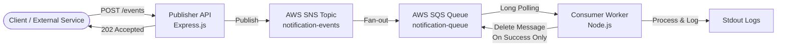

# Decoupled Event-Driven Notification Service

A scalable, resilient Notification Service built using an **Event-Driven Architecture (EDA)** pattern with **AWS SNS** and **AWS SQS**. This project decouples HTTP request ingestion from background processing, ensuring reliable, fault-tolerant message handling under heavy load.

## Architecture & Design Choices

The system contains three major components orchestrated via Docker Compose:
1. **Publisher Service (API Gateway)**: An Express.js microservice that validates incoming requests and publishes them immediately to an AWS SNS Topic before returning a `202 Accepted` response.
2. **AWS Messaging Backbone**: Amazon SNS broadcasts messages to all subscribers. An Amazon SQS Queue is subscribed to the SNS Topic, acting as a buffer that stores events securely.
3. **Consumer Service (Background Worker)**: A Node.js daemon that continuously polls SQS using Long Polling, processes the events, and deletes them from SQS *only* upon successful completion.



### Key Decisions
* **Decoupled Scaling**: Separating the publisher and consumer allows the ingestion API to scale out independently to handle traffic spikes, while the background worker scales independently based on queue length.
* **Resilience & Data Protection**: In the consumer service, messages are deleted from SQS *strictly after* processing succeeds. If the worker crashes or fails during execution, the message's visibility timeout expires in SQS, making the message available again for retry automatically. This prevents data loss.
* **Polling Efficiency**: SQS Long Polling (`WaitTimeSeconds: 20`) is used to minimize empty API responses, reducing network traffic and AWS service fees.

---

## Directory Structure

```text
.
├── consumer_service/
│   ├── app/
│   │   ├── consumer.js       # SQS Polling, Parsing & Safe-Deletion logic
│   │   └── index.js          # Consumer Service daemon entry point
│   ├── Dockerfile            # Multi-stage build for production runtime
│   ├── package.json          # Service manifest and dependencies
│   └── package-lock.json
├── publisher_service/
│   ├── app/
│   │   ├── app.js            # Express API, Healthcheck & Joi Schema Validation
│   │   └── index.js          # Publisher Service HTTP server entry point
│   ├── Dockerfile            # Multi-stage build for production runtime
│   ├── package.json          # Service manifest and dependencies
│   └── package-lock.json
├── localstack-setup/
│   └── init-aws.sh           # LocalStack resources provisioner (SNS, SQS, Subscription)
├── tests/
│   ├── consumer.test.js      # SQS processing logic & error handling tests
│   └── publisher.test.js     # API validation & SNS mock publishing tests
├── docker-compose.yml        # Docker Multi-service orchestrator
├── .env.example              # Environment variables template
├── package.json              # Root workspace manifest for dev & testing
└── package-lock.json
```

---

## Setup & Execution

### 1. Configure Environment Variables
Copy the env template file to a local `.env` configuration file:
```bash
cp .env.example .env
```

### 2. Run the Stack (Docker Compose)
Start the publisher, consumer, and LocalStack (AWS emulator) in the background:
```bash
docker compose up -d --build
```
This automatically compiles both Node.js services using multi-stage builds, starts the local AWS resources, and configures the SNS topic, SQS queue, and subscription binding.

To verify that the containers are healthy and running:
```bash
docker compose ps
```

---

## Interacting with the API

### Send a Valid Event (Success)
Submit an event payload to the API:
```bash
curl -X POST -H "Content-Type: application/json" \
  -d '{
    "eventType": "USER_REGISTERED",
    "recipient": "user@example.com",
    "data": { "name": "Alice" }
  }' \
  http://localhost:8000/events
```
**Response (`202 Accepted`)**:
```json
{
  "message": "Event accepted for processing"
}
```

### Send an Invalid Event (Validation Error)
Submit an invalid event payload (e.g. missing `recipient`):
```bash
curl -X POST -H "Content-Type: application/json" \
  -d '{
    "eventType": "USER_REGISTERED",
    "data": { "name": "Alice" }
  }' \
  http://localhost:8000/events
```
**Response (`400 Bad Request`)**:
```json
{
  "error": "Validation Error",
  "details": [
    "\"recipient\" is required"
  ]
}
```

### Monitor Background Processing
Inspect the Consumer stdout logs to see SQS events being consumed and processed in real time:
```bash
docker compose logs consumer -f
```
**Expected Output**:
```text
Consumer worker started, polling SQS queue...
Processing event 'USER_REGISTERED' for 'user@example.com' with data: {"name":"Alice"}
```

---

## Running Automated Tests

The testing suite uses **Jest** and **Supertest** along with `@aws-sdk/client-mock` to test application layers in isolation.

### 1. Install Dev Dependencies
Install the required packages in the root workspace directory:
```bash
npm install
```

### 2. Run Tests
Execute the tests:
```bash
npm test
```
The suite runs unit tests validating Express payload structure schemas and integration tests mocking SNS/SQS client actions.
